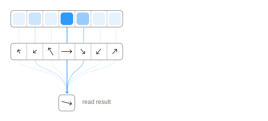
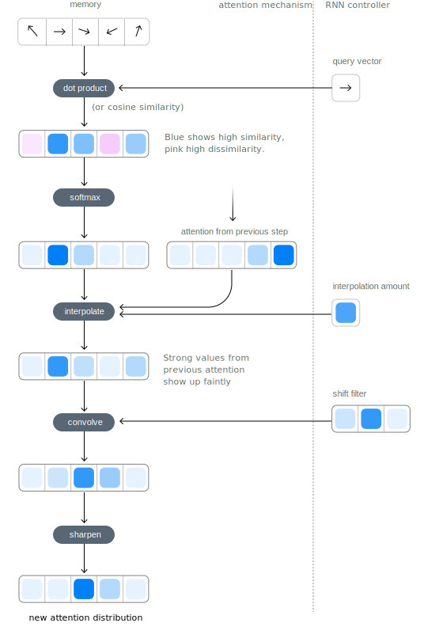
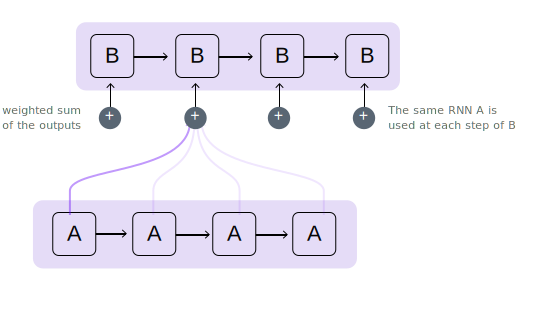

# Understanding Augmented Recurrent Neural Networks

  

    

      
Chris Olah

      
Google Brain

    

    

      
Shan Carter

      
Google Brain

    

  

  

    
Jan. 1

    
2016

  

  

    
Olah & Carter, 2016

    
BibTeX
 <!-- This should be a link. -->
  

Recurrent neural networks are one of the staples of deep learning, allowing neural networks to work with sequences of data like text, audio and video. They can be used to boil a sequence down into a high-level understanding, to annotate sequences, and even to generate new sequences from scratch!

<figure>
  <figcaption>A basic recurrent neural network uses one cell several times to help understand sequences.</figcaption>
  </img>
</figure>

The basic RNN design struggles with longer sequences, but if you use [LSTM networks](http://colah.github.io/posts/2015-08-Understanding-LSTMs/), a special kind of RNN, they can even work with these. Such models have been found to be very powerful, achieving remarkable results in many tasks including translation, voice recognition, and image captioning. As a result, recurrent neural networks have become very widespread in the last few years.

As this happened, we’ve seen a growing number of attempts to augment RNNs with new properties. Four directions stand out as particularly exciting:

* *Neural Turing Machines* have external memory that they can read and write to.
* *Attentional Interfaces* allow RNNs to focus on part of the information they’re given.
* *Adaptive Computation Time* allows for varying amounts of computation per step.
* *Neural Programmers* can call functions, building programs as they run.

Individually, these techniques are all potent extensions of RNNs, but the really striking thing is that they can be combined together. My guess is that these "augmented RNNs" will radically extend what deep learning is capable of in the coming years.

### Neural Turing Machines

Neural Turing Machines ([Graves, *et al.*, 2014](https://arxiv.org/pdf/1410.5401v2.pdf)) combine a RNN with an external memory bank. Since vectors are the natural language of neural networks, the memory is arranged as an array of vectors:

<figure>
  <figcaption>Memory is an array of vectors.</figcaption>
  <figcaption style="top: 100px;">At every time step, the RNN controller can read from and write to this external memory.</figcaption>
  </img>
</figure>

But how does reading and writing work? The challenge is that we want to make them differentiable. In particular, we want to make them differentiable with respect to the location we read from or write to, so that we can learn where to read and write. This is tricky, because memory addresses seem to be fundamentally discrete.

NTMs take a very clever solution to this: every step, they read and write everywhere, just to different extents. As an example, let’s focus on reading. Instead of specifying a single location, the RNN gives “attention distribution” which describe how we spread out the amount we care about different memory positions. As such, the result of the read operation is a weighted sum.

<figure>
  <figcaption><b>When reading</b>, The RNN reads from everywhere, just to different extents. the result of the read operation is a weighted sum.</figcaption>
  </img>
</figure>

<figure>
  <figcaption><b>When writing</b> the RNN reads from everywhere, just to different extents</figcaption>
  </img>
</figure>

Similarly, we write everywhere at once to different extents. Again, an attention distribution describes how much we write at every location. We do this by having the new value of a position in memory be a convex combination of the old memory content and the write value, with the position between the two decided by the attention weight.

But how do NTMs distribute their attention over positions in memory? They actually combine together two different attention mechanisms: content-based attention and location-based attention. Content-based attention allows NTMs to search through their memory and move to places that match what they’re looking for, while location-based attention allows relative movement in memory, enabling the NTM to loop.

The addressing process starts with the generating the content-based focus. First, the controller gives a “query” vector, describing what we should focus on. Each memory entry is scored for similarity with the query, using either a dot product or cosine similarity. The scores are then converted into an attention distribution using softmax.

<figure>
  <figcaption>First, the controller gives a query vector, describing what we should focus on. Each memory entry is scored for similarity with the query.</figcaption>
  <figcaption style="top: 200px;">The scores are then converted into an attention distribution using softmax.</figcaption>
  <figcaption style="top: 300px;">Next, we interpolate the attention from the previous time step. </figcaption>
  <figcaption style="top: 400px;">We convolve the attention with a shift filter — this allows the controller to move relative to the position it is anchored to.</figcaption>
  <figcaption style="top: 600px;">Finally, we sharpen the attention distribution to concentrate our focus. This final attention distribution is fed to the read or write operation.</figcaption>
  </img>
</figure>

This capability to read and write allows NTMs to perform many simple algorithms, previously beyond neural networks. They can learn to store a sequence in memory, and then loop over it, repeating it back. They can learn to mimic a lookup table. They can even learn to sort numbers (although they kind of cheat)! On the other hand, they still can’t do many basic things, like add or multiply numbers.

Since the original NTM paper, there's been a number of exciting papers exploring similar directions. The Neural GPU ([Kaiser & Sutskever, 2015](http://arxiv.org/pdf/1511.08228v3.pdf)) overcomes the NTM's inability to add and multiply numbers.  [Zaremba & Sutskever, 2016](http://arxiv.org/pdf/1505.00521.pdf) train NTMs using reinforcement learning instead of the differentiable read/writes used by the original. Neural Random Access Machines ([Kurach *et al.*, 2015]( http://arxiv.org/pdf/1511.06392.pdf)) work based on pointers. Some papers have explored differntiable data structures, like stacks and queues ([Grefenstette *et al*. 2015](http://papers.nips.cc/paper/5648-learning-to-transduce-with-unbounded-memory.pdf); [Joulin & Mikolov, 2015](https://arxiv.org/pdf/1503.01007v4.pdf)). And memory networks ([Weston *et al.*, 2014](http://arxiv.org/abs/1410.3916); [Kumar *et al.*, 2015](http://arxiv.org/abs/1506.07285)) are another approach to attacking similar problems.

*(TODO: make above more readable)*

### Attentional Interfaces

When I’m translating a sentence, I pay special attention to the word I’m presently translating. When I’m transcribing an audio recording, I listen carefully to the segment I’m actively writing down. And if you ask me to describe the room I’m sitting in, I’ll glance around at the objects I’m describing as I do so.

Neural networks can achieve this same behavior using *attention*, focusing on part of a subset of the information they're given. For example, an RNN can attend over the output of another RNN. At every time step, it focuses on different positions in the other RNN.

We'd like attention to be differentiable, so that we can learn where to focus. To do this, we use the same trick Neural Turing Machiens use: we focus everywhere, just to different extents.

<figure>
  <figcaption>We use the same trick Neural Turing Machines use: we focus everywhere, just to different extents.</figcaption>
  </img>
</figure>

The attention distribution is usually generated with content-based attention. The attending RNN generates a query describing what it wants to focus on. Each item is dot producted with the query to produce a score, describing how welll it matches the query. The scores are fed into a softmax to create the attention distribution.

</img>

Attention between two RNNs can be used in translation. A traditional sequence-to-sequence model has to boil the entire input down into a single vector and then expands it back out. Attention avoids this by allowing the RNN processing the input to pass along information about each word it sees, and then for the RNN generating the output to focus on words as they become relevant.

</img>

([Bahdanau, *et al.* 2014](https://arxiv.org/pdf/1409.0473.pdf))

This kind of attention between RNNs can also be used in translation. This allows one RNN to process the audio, and then another to skim through it, focusing on the relevant parts to generate a transcript.

</img>

([Chan, *et al.* 2015](https://arxiv.org/pdf/1508.01211.pdf))

Attention can also be used on the interface between a convolutional neural network and an RNN. This can allow an RNN to do things like look at a different position in an image every step.

</img>

*(TODO: Captioning example)*

### Adaptive Computation Time

Standard RNNs do the same amount of computation each time step. This seems unintuitive -- surely, one should think more when things are hard? -- and limits RNNs to doing $O(n)$ operations. Adaptive Computation Time ([Graves, 2016](https://arxiv.org/pdf/1603.08983v4.pdf)), or ACT, is a way for RNNs to do variable amounts of computation each step.

The big picture idea is simple: allow the RNN to do multiple steps of computation for each time step.

</img>

In order for the network to learn how many steps to do, we want the number of steps to be differentiable. We achieve this with the same trick we used before: we consider an attention distribution over computation steps, and have the output be a weigthed combination of the states at each step. We also want the RNN to know when it has moved on to a new step, so we set a special bit on the input for the first computation step of each time step.

There are a few more details, which were left out in the previous diagram. Here's a complete diagram of a time step with three computation steps.

</img>

That's a bit complicated, so let's work through it step by step. At a high-level, we're still running the RNN and outputing a weighted combination of the states:

</img>

The weight for each step is determined by a "halting neuron". It's a sigmoid neuron that looks at the RNN state and gives an atteing weight, which we can think of as the probability that we should stop at that step.

</img>

We have a total budget for the halting weights of 1, so we track that budget along the top. When it gets to less than epsilon, we stop.

</img>

When we stop, might have some left over halting budget because we stop when it gets to less than epsilon. What should we do with it? Technically, it's being given to future steps but we don't want to compute those, so we attribute it to the last step.

</img>

### Neural Programmer

</img>

</img>

### Conclusion
