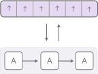
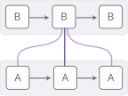
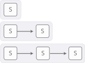
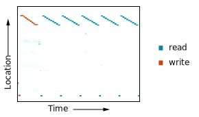

<link rel="stylesheet" type="text/css" href="assets/common.css">

<h1>{{ typewriter.title }}</h1>
<!--
{{ typewriter.description }}
-->
{{> byline.html}}

Recurrent neural networks are one of the staples of deep learning, allowing neural networks to work with sequences of data like text, audio and video. They can be used to boil a sequence down into a high-level understanding, to annotate sequences, and even to generate new sequences from scratch!

<!-- Comment on inputs/outputs in figure? -->
<figure class="w-body">
  {{> assets/rnn_basic_rnn.svg}}
</figure>

The basic RNN design struggles with longer sequences, but a special variant -- ["long short-term memory" networks][olah2015lstm] -- can even work with these. Such models have been found to be very powerful, achieving remarkable results in many tasks including translation, voice recognition, and image captioning. As a result, recurrent neural networks have become very widespread in the last few years.

As this has happened, we’ve seen a growing number of attempts to augment RNNs with new properties. Four directions stand out as particularly exciting:

<figure class="w-body-plus" id="previews">
  <a href="#neural-turing-machines">
    
    <figcaption><b>Neural Turing Machines</b> have external memory that they can read and write to.</figcaption>
  </a>
  <a href="#attentional-interfaces">
    
    <figcaption><b>Attentional Interfaces</b> allow RNNs to focus on parts of their input.</figcaption>
  </a>
  <a href="#adaptive-computation-time">
    
    <figcaption><b>Adaptive Computation Time</b> allows for varying amounts of computation per step.</figcaption>
  </a>
  <a href="#neural-programmer">
    
    <figcaption><b>NeuralProgrammers</b> can call functions, building programs as they run.</figcaption>
  </a>
</figure>

Individually, these techniques are all potent extensions of RNNs, but the really striking thing is that they can be combined together, and seem to just be points in a broader space. Further, they all rely on the same underlying trick -- something called attention -- to work.

Our guess is that these "augmented RNNs" will have an important role to play in extending deep learning's capabilities over the coming years.

---

## Neural Turing Machines

Neural Turing Machines ([Graves, *et al.*, 2014]) combine a RNN with an external memory bank. Since vectors are the natural language of neural networks, the memory is an array of vectors:

<figure class="w-body-plus"  id="rnn-memory">
  {{> assets/rnn_memory.svg}}
</figure>

But how does reading and writing work? The challenge is that we want to make them differentiable. In particular, we want to make them differentiable with respect to the location we read from or write to, so that we can learn where to read and write. This is tricky because memory addresses seem to be fundamentally discrete. NTMs take a very clever solution to this: every step, they read and write everywhere, just to different extents.

As an example, let’s focus on reading. Instead of specifying a single location, the RNN gives “attention distribution” which describe how we spread out the amount we care about different memory positions. As such, the result of the read operation is a weighted sum.

<figure class="w-body-plus" id="rnn-read">
  {{> assets/rnn_read.svg}}
</figure>

Similarly, we write everywhere at once to different extents. Again, an attention distribution describes how much we write at every location. We do this by having the new value of a position in memory be a convex combination of the old memory content and the write value, with the position between the two decided by the attention weight.

<figure class="w-body-plus" id="rnn-write">
  {{> assets/rnn_write.svg}}
</figure>

{{> assets/rnn_write.html}}

But how do NTMs decide which positions in memory to focus their attention on? They actually use a combination of two different methods: content-based attention and location-based attention. Content-based attention allows NTMs to search through their memory and focus on places that match what they’re looking for, while location-based attention allows relative movement in memory, enabling the NTM to loop.

<figure class="w-page" id="rnn-write-detail">
  {{> assets/rnn_write_detail.svg}}
</figure>

{{> assets/rnn_write_detail.html}}

This capability to read and write allows NTMs to perform many simple algorithms, previously beyond neural networks. For example, they can learn to store a long sequence in memory, and then loop over it, repeating it back repeatedly. As they do this, we can watch where they read and write, to better understand what they're doing:

<figure class="p-right-margin external">
  </img>
  <figcaption style="bottom: 0px;">See more experiments in [Graves, *et al.*, 2014]. This figure is based on the Repeat Copy experiment.</figcaption>
</figure>

They can also learn to mimic a lookup table, or even learn to sort numbers (although they kind of cheat)! On the other hand, they still can’t do many basic things, like add or multiply numbers.

Since the original NTM paper, there's been a number of exciting papers exploring similar directions. The Neural GPU ([Kaiser & Sutskever, 2015]) overcomes the NTM's inability to add and multiply numbers.  [Zaremba & Sutskever, 2016] train NTMs using reinforcement learning instead of the differentiable read/writes used by the original. Neural Random Access Machines ([Kurach *et al.*, 2015]) work based on pointers. Some papers have explored differentiable data structures, like stacks and queues ([Grefenstette *et al*. 2015]; [Joulin & Mikolov, 2015]). And memory networks ([Weston *et al.*, 2014]; [Kumar *et al.*, 2015]) are another approach to attacking similar problems.

In some objective sense, many of the tasks these models can perform -- such as learning how to add numbers -- aren't that objectively hard. The traditional program synthesis community would eat them for lunch. But neural networks are capable of many other things, and models like the Neural Turing Machine seem to have knocked away a very profound limit on their abilities.

### Code

There are a number of open source implementations of these models. Open source implementations of the Neural Turing Machine include [Taehoon Kim's](https://github.com/carpedm20/NTM-tensorflow) (TensorFlow), [Shawn Tan's](https://github.com/shawntan/neural-turing-machines) (Theano), [Fumin's](https://github.com/fumin/ntm) (Go), [Kai Sheng Tai's](https://github.com/kaishengtai/torch-ntm) (Torch), and [Snip's](https://github.com/snipsco/ntm-lasagne) (Lasagne). Code for the Neural GPU publication was open sourced and put in the [TensorFlow Models repository](https://github.com/tensorflow/models/tree/master/neural_gpu). Open source implementations of Memory Networks include [Facebook's](https://github.com/facebook/MemNN) (Torch/Matlab), [YerevaNN's](https://github.com/YerevaNN/Dynamic-memory-networks-in-Theano) (Theano), and [Taehoon Kim's](https://github.com/carpedm20/MemN2N-tensorflow) (TensorFlow). 

---

## Attentional Interfaces

When I’m translating a sentence, I pay special attention to the word I’m presently translating. When I’m transcribing an audio recording, I listen carefully to the segment I’m actively writing down. And if you ask me to describe the room I’m sitting in, I’ll glance around at the objects I’m describing as I do so.

Neural networks can achieve this same behavior using *attention*, focusing on part of a subset of the information they're given. For example, an RNN can attend over the output of another RNN. At every time step, it focuses on different positions in the other RNN.

We'd like attention to be differentiable, so that we can learn where to focus. To do this, we use the same trick Neural Turing Machines use: we focus everywhere, just to different extents.

<figure class="w-body">
  {{> assets/rnn_attentional_01.svg}}
</figure>

The attention distribution is usually generated with content-based attention. The attending RNN generates a query describing what it wants to focus on. Each item is dot producted with the query to produce a score, describing how well it matches the query. The scores are fed into a softmax to create the attention distribution.

<figure class="w-body">
  {{> assets/rnn_attentional_02.svg}}
</figure>

One use of attention between RNNs is translation ([Bahdanau, *et al.* 2014]). A traditional sequence-to-sequence model has to boil the entire input down into a single vector and then expands it back out. Attention avoids this by allowing the RNN processing the input to pass along information about each word it sees, and then for the RNN generating the output to focus on words as they become relevant.

{{> assets/rnn_attentional_ex2.html}}

This kind of attention between RNNs has a number of other applications. It can be used in voice recognition ([Chan, *et al.* 2015]), allowing one RNN process the audio and then have another RNN skim over it, focusing on relevant parts as it generates a transcript.

{{> assets/rnn_attentional_ex3.html}}

Other uses of this kind of attention include parsing text ([Vinyals, *et al.*, 2014]), where it allows the model to glance at words as it generates the parse tree, and for conversational modeling ([Vinyals & Le, 2015]), where it lets the model focus on previous parts of the conversation as it generates its response.

Attention can also be used on the interface between a convolutional neural network and an RNN. This allows the RNN to look at different position of an image every step. One popular use of this kind of attention is for image captioning. First, a conv net processes the image, extracting high-level features. Then an RNN runs, generating a description of the image. As it generates each word in the description, the RNN focuses on the conv nets interpretation of the relevant parts of the image. We can explicitly visualize this:

<figure class="w-body-plus external">
  
  <figcaption style="bottom: 0px;">Figure from [Xu, *et al.*, 2015]</figcaption>
</figure>

More broadly, attentional interfaces can be used whenever one wants to interface with a neural network that has a repeating structure in its output.

Attentional interfaces have been found to be an extremely general and powerful technique, and are becoming increasingly widespread.

---

## Adaptive Computation Time

Standard RNNs do the same amount of computation each time step. This seems unintuitive. Surely, one should think more when things are hard? It also limits RNNs to doing O(n) operations for a list of length n.

Adaptive Computation Time ([Graves, 2016]), is a way for RNNs to do different amounts of computation each step. The big picture idea is simple: allow the RNN to do multiple steps of computation for each time step.

In order for the network to learn how many steps to do, we want the number of steps to be differentiable. We achieve this with the same trick we used before: instead of deciding to run for a discrete number of steps, we have a attention distribution over the number of steps to run. The output is a weighted combination of the outputs of each step.

<figure class="w-page">
  {{> assets/rnn_adaptive_01.svg}}
</figure>

There are a few more details, which were left out in the previous diagram. Here's a complete diagram of a time step with three computation steps.

<figure class="w-body-plus">
  {{> assets/rnn_adaptive_02.svg}}
</figure>

That's a bit complicated, so let's work through it step by step. At a high-level, we're still running the RNN and outputting a weighted combination of the states:

<figure class="w-body-plus">
  {{> assets/rnn_adaptive_02_1.svg}}
</figure>

The weight for each step is determined by a "halting neuron". It's a sigmoid neuron that looks at the RNN state and gives an halting weight, which we can think of as the probability that we should stop at that step.

<figure class="w-body-plus">
  {{> assets/rnn_adaptive_02_2.svg}}
</figure>

We have a total budget for the halting weights of 1, so we track that budget along the top. When it gets to less than epsilon, we stop.

<figure class="w-body-plus">
  {{> assets/rnn_adaptive_02_3.svg}}
</figure>

When we stop, might have some left over halting budget because we stop when it gets to less than epsilon. What should we do with it? Technically, it's being given to future steps but we don't want to compute those, so we attribute it to the last step.

<figure class="w-body-plus">
  {{> assets/rnn_adaptive_02_4.svg}}
</figure>

When training Adaptive Computation Time models, one adds a "ponder cost" term to the cost function. This penalizes the model for the amount of computation it uses. The bigger you make this term, the more it will trade-off performance for lowering compute time.

Adaptive Computation Time is a very new idea, but we believe that it, along with similar ideas, will be very important.

### Code

The only open source implementation of Adaptive Computation Time at the moment seems to be [Mark Neumann's](https://github.com/DeNeutoy/act-tensorflow) (TensorFlow).

---

## Neural Programmer

Neural nets are excellent at many tasks, but they also struggle to do some basic things like arithmetic, which are trivial in normal approaches to computing. It would be really nice to have a way to fuse neural nets with normal programming, and get the best of both worlds.

The neural programmer ([Neelakantan, *et al.*, 2015]) is one approach to this. It learns to create programs in order to solve a task. In fact, it learns to generate such programs *without needing examples of correct programs*. It discovers how to produce programs as a means to the end of accomplishing some task.

The actual model in the paper answers questions about tables by generating SQL-like programs to query the table. However, there are a number of details here that make it a bit complicated, so let's start by imagining a slightly simpler model, which is given an arithmetic expression and generates a program to evaluate it.

The generated program is a sequence of operations. Each operation is defined to operate on the output of past operations. So an operation might be something like "add the output of the operation 2 steps ago and the output of the operation 1 step ago." It's more like a unix pipe than a program with variables being assigned to and read from.

<figure class="w-body">
  {{> assets/rnn_programmer_1.svg}}
</figure>

The program is generated one operation at a time by a controller RNN. At each step, the controller RNN outputs a probability distribution for what the next operation should be. For example, we might be pretty sure we want to perform addition at the first time step, then have a hard time deciding whether we should multiply or divide at the second step, and so on...

<figure class="w-body">
  {{> assets/rnn_programmer_2.svg}}
</figure>

The resulting distribution over operations can now be evaluated. Instead of running a single operation at each step, we do the usual attention trick of running all of them and then average the outputs together, weighted by the probability we ran that operation.

<figure class="w-body">
  {{> assets/rnn_programmer_3.svg}}
</figure>

As long as we can define derivatives through the operations, the program's output is differentiable with respect to the probabilities. We can then define a loss, and train the neural net to produce programs that give the correct answer. In this way, the Neural Programmer learns to produce programs without examples of good programs. The only supervision is the answer the program should produce.

That's the core idea of Neural Programmer, but the version in the paper answers questions about tables, rather than arithmetic expressions. There's a few additional neat tricks:

* **Multiple Types:** Many of the operations in the Neural Programmer deal with types other than scalar numbers. Some operations output selections of table columns or selections of cells. <!-- footnote? (To allow us to backprop through the selecting things and average selections, we allow things to be selected to different extents, with 0 as unselected and 1 as fully selected.) --> Only outputs of the same type get merged together.

* **Referencing Inputs:** The neural programmer needs to answer questions like "How many cities have a population greater than 1,000,000?" given a table of cities with a population column. To facilitate this, some operations allow the network to reference constants in the question they're answering, or the names of columns. This referencing happens by attention, in the style of pointer networks ([Vinyals, *et al.*, 2015]). <!-- For example, in order to use the *Greater* operation, the controller must select a value that table entries are greater than; instead of using a previous scalar value it's computed, it has the controller select a value in the question using attention. -->

The Neural Programmer isn't the only approach to having neural networks generate programs. Another lovely approach is the Neural Programmer-Interpreter ([Reed & de Freitas, 2015]) which can accomplish a number of very interesting tasks, but requires supervision in the form of correct programs.

We think that this general space, of bridging the gap between more traditional programming and neural networks is extremely important. While the Neural Programmer is clearly not the final solution, we think there are a lot of important lessons to be learned from it.

### Code

There don't seem to be any open source implementations of the Neural Programmer at present, but there is an implementation of the Neural Programmer-Interpreter by [Ken Morishita](https://github.com/mokemokechicken/keras_npi) (Keras).

---

## The Big Picture

A human with a piece of paper is, in some sense, much smarter than a human without. A human with mathematical notation can solve problems they otherwise couldn't. Access to computers makes us capable of incredible feats that would otherwise be far beyond us.

In general, it seems like a lot of interesting forms of intelligence are an interaction between the creative heuristic intuition of humans and some more crisp and careful media, like language or equations. Sometimes, the medium is something that physically exists, and stores information for us, prevents us from making mistakes, or does computational heavy lifting. In other cases, the medium is a model in our head that we manipulate. Either way, it seems deeply fundamental to intelligence.

Recent results in machine learning have started to have this flavor, combining the intuition of neural networks with something else. One approach is what one might call "heuristic search." For example, AlphaGo ([Silver, *et al.*, 2016]) has a model of how Go works and explores how the game could play out guided by neural network intuition. Similarly, DeepMath ([Alemi, *et al.*, 2016]) uses neural networks as intuition for manipulating mathematical expressions. The "augmented RNNs" we've talked about in this article are another approach, where we connect RNNs to engineered media, in order to extend their general capabilities.

Interacting with media naturally involves making a sequence of taking an action, observing, and taking more actions. This creates a major challenge: how do we learn which actions to take? That sounds like a reinforcement learning problem and we could certainly take that approach. But the reinforcement learning literature is really attacking the hardest version of this problem, and its solutions are hard to use. The wonderful thing about attention is that it gives us an easier way out of this problem by partially taking all actions to varying extents. This works because we can design media -- like the NTM memory -- to allow fractional actions and to be differentiable. Reinforcement learning has us take a single path, and try to learn from that. Attention takes every direction at a fork, and then merges the paths back together.

A major weaknesses of attention is that we have to take every "action" every step. This causes the computational cost to grow linearly as you do things like increase the amount of memory in a Neural Turing Machine. One thing you could imagine doing is having your attention be sparse, so that you only have to touch some memories. However, it's still challenging because you may want to do things like have your attention depend on the content of the memory, and doing that naively forces you to look at each memory. We've seen some initial attempts to attack this problem, such as [Andrychowicz & Kurach, 2016], but it seems like there's a lot more to be done. If we could really make such sub-linear time attention work, that would be very powerful!

Augmented recurrent neural networks, and the underlying technique of attention, are incredibly exciting. We look forward to seeing what happens next!

[Alemi, *et al.*, 2016]: https://arxiv.org/pdf/1606.04442.pdf
[Andrychowicz & Kurach, 2016]: https://arxiv.org/pdf/1602.03218.pdf
[Bahdanau, *et al.* 2014]: https://arxiv.org/pdf/1409.0473.pdf
[Chan, *et al.* 2015]: https://arxiv.org/pdf/1508.01211.pdf
[Graves, *et al.*, 2014]: https://arxiv.org/pdf/1410.5401.pdf
[Graves, 2016]: https://arxiv.org/pdf/1603.08983v4.pdf
[Grefenstette *et al*. 2015]: http://papers.nips.cc/paper/5648-learning-to-transduce-with-unbounded-memory.pdf
[Joulin & Mikolov, 2015]: https://arxiv.org/pdf/1503.01007.pdf
[Kaiser & Sutskever, 2015]: http://arxiv.org/pdf/1511.08228.pdf
[Kumar *et al.*, 2015]: http://arxiv.org/abs/1506.07285
[Kurach *et al.*, 2015]: http://arxiv.org/pdf/1511.06392.pdf
[Neelakantan, *et al.*, 2015]: http://arxiv.org/abs/1511.04834
[olah2015lstm]: http://colah.github.io/posts/2015-08-Understanding-LSTMs/
[Reed & de Freitas, 2015]: https://arxiv.org/pdf/1511.06279.pdf
[Silver, *et al.*, 2016]: http://willamette.edu/~levenick/cs448/goNature.pdf
[Vinyals, *et al.*, 2014]: https://arxiv.org/pdf/1412.7449.pdf
[Vinyals & Le, 2015]: http://arxiv.org/pdf/1506.05869.pdf
[Vinyals, *et al.*, 2015]: https://arxiv.org/pdf/1506.03134.pdf
[Weston *et al.*, 2014]: http://arxiv.org/abs/1410.3916
[Xu, *et al.*, 2015]: https://arxiv.org/pdf/1502.03044.pdf
[Zaremba & Sutskever, 2016]: http://arxiv.org/pdf/1505.00521.pdf

<!-- Appendix -->
<section class="appendix w-body">
  <h3>Acknowledgments</h3>
  
Thank you to Maithra Raghu, Dario Amodei, Cassandra Xia, Luke Vilnis, Anna Goldie, Jesse Engel, Dan Mané, Natasha Jaques, Emma Pierson and Ian Goodfellow for their feedback and encouragement. We're also very grateful to our team, <a href="http://g.co/brain">Google Brain</a>, for being extremely supportive of our project.
  <h3 id="citation">Errors, Reuse, and Citation</h3>
  
If you see mistakes or want to suggest changes, please submit a pull request on <a href="{{{typewriter.github}}}">github</a>.
  
Diagrams and text are licensed under Creative Commons Attribution <a href="https://creativecommons.org/licenses/by/2.0/">CC-BY 2.0</a>, unless noted otherwise, with the source available on available on <a href="{{{typewriter.github}}}">github</a>. The figures that have been reused from other sources don't fall under this license and can be recognized by a note in their caption: "Figure from …".
  
For attribution in academic contexts, please cite this work as
  <pre class="citation">Chris Olah & Shan Carter, "{{typewriter.title}}", Distill, {{typewriter.firstPublishedYear}}.</pre>
  
BibTeX citation
  {{=<% %>=}}
<pre class="citation">@misc{<%typewriter.slug%>,
  author = {<%typewriter.bibtexAuthors%>},
  title = {<%typewriter.title%>},
  year = {<%typewriter.firstPublishedYear%>},
  howpublished = {<%typewriter.url%>}
}</pre>

  <%={{ }}=%>
  <h3>References</h3>
  <ul class="references">
    <li>Alemi, A. A., Chollet, F., Irving, G., Szegedy, C., & Urban, J. (2016). DeepMath-Deep Sequence Models for Premise Selection. arXiv preprint arXiv:1606.04442.</li>
    <li>Andrychowicz, M., & Kurach, K. (2016). Learning Efficient Algorithms with Hierarchical Attentive Memory. arXiv preprint arXiv:1602.03218.</li>
    <li>Bahdanau, D., Cho, K., & Bengio, Y. (2014). Neural machine translation by jointly learning to align and translate. arXiv preprint arXiv:1409.0473.</li>
    <li>Chan, W., Jaitly, N., Le, Q. V., & Vinyals, O. (2015). Listen, attend and spell. arXiv preprint arXiv:1508.01211.</li>
    <li>Graves, A., Wayne, G., & Danihelka, I. (2014). Neural turing machines. arXiv preprint arXiv:1410.5401.</li>
    <li>Graves, A. (2016). Adaptive Computation Time for Recurrent Neural Networks. arXiv preprint arXiv:1603.08983.</li>
    <li>Grefenstette, E., Hermann, K. M., Suleyman, M., & Blunsom, P. (2015). Learning to transduce with unbounded memory. In Advances in Neural Information Processing Systems (pp. 1828-1836).</li>
    <li>Joulin, A., & Mikolov, T. (2015). Inferring algorithmic patterns with stack-augmented recurrent nets. In Advances in Neural Information Processing Systems (pp. 190-198).</li>
    <li>Kaiser, Ł., & Sutskever, I. (2015). Neural gpus learn algorithms. arXiv preprint arXiv:1511.08228.</li>
    <li>Kumar, A., Irsoy, O., Su, J., Bradbury, J., English, R., Pierce, B., Ondruska, P., Gulrajani, I. & Socher, R., (2015). Ask me anything: Dynamic memory networks for natural language processing. arXiv preprint arXiv:1506.07285.</li>
    <li>Kurach, K., Andrychowicz, M., & Sutskever, I. (2015). Neural random-access machines. arXiv preprint arXiv:1511.06392.</li>
    <li>Neelakantan, A., Le, Q. V., & Sutskever, I. (2015). Neural programmer: Inducing latent programs with gradient descent. arXiv preprint arXiv:1511.04834.</li>
    <li>Olah, C. (2015). Understanding LSTM Networks.</li>
    <li>Reed, S., & de Freitas, N. (2015). Neural programmer-interpreters. arXiv preprint arXiv:1511.06279.</li>
    <li>Silver, D., Huang, A., Maddison, C.J., Guez, A., Sifre, L., Van Den Driessche, G., Schrittwieser, J., Antonoglou, I., Panneershelvam, V., Lanctot, M. & Dieleman, S. (2016). Mastering the game of Go with deep neural networks and tree search. Nature, 529(7587), 484-489.</li>
    <li>Vinyals, O., Kaiser, Ł., Koo, T., Petrov, S., Sutskever, I., & Hinton, G. (2015). Grammar as a foreign language. In Advances in Neural Information Processing Systems (pp. 2773-2781).</li>
    <li>Vinyals, O., & Le, Q. (2015). A neural conversational model. arXiv preprint arXiv:1506.05869.</li>
    <li>Vinyals, O., Fortunato, M., & Jaitly, N. (2015). Pointer networks. In Advances in Neural Information Processing Systems (pp. 2692-2700).</li>
    <li>Weston, J., Chopra, S., & Bordes, A. (2014). Memory networks. arXiv preprint arXiv:1410.3916.</li>
    <li>Xu, K., Ba, J., Kiros, R., Cho, K., Courville, A., Salakhutdinov, R., Zemel, R.S. & Bengio, Y., 2015. (2015). Show, attend and tell: Neural image caption generation with visual attention. arXiv preprint arXiv:1502.03044, 2(3), 5.</li>
    <li>Zaremba, W., & Sutskever, I. (2015). Reinforcement learning neural Turing machines. arXiv preprint arXiv:1505.00521, 362.</li>
  </ul>
</section>
